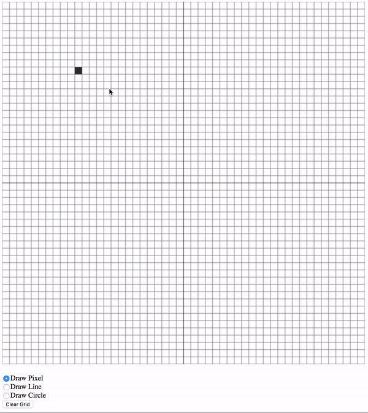

# WebGL Simulated Pixel Display #

This web application is a simple simulation of a pixel display that is typically
used on a computer monitor.

* [Getting Started](#gettingstarted)
* [Quick Demo](#webdemo)

Getting Started 
===============

Download or clone the repository and open the index.html file in any web browser.
Everything else will be loaded and feel free to jump right in!

Quick Demo 
==========
Here is the simulation in action!

What is it? 
===========
The goal is to simulate computational graphics concepts that occur when drawing
pixels on a raster display. First, the geometry is calculated to know where to
draw the pixel, circle, or line. Then, then the image is rasterized to fit the
pixel display and show the drawing. This just to give an idea how computational
graphics work.
